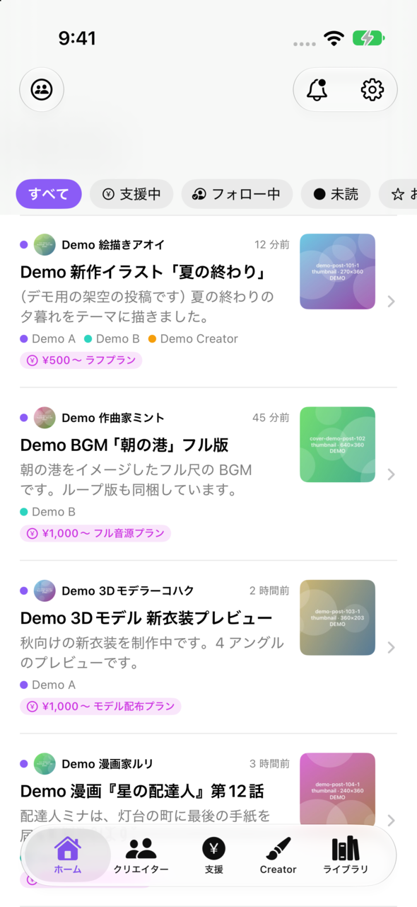
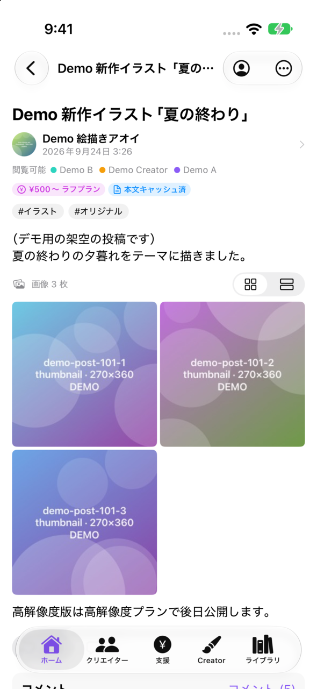
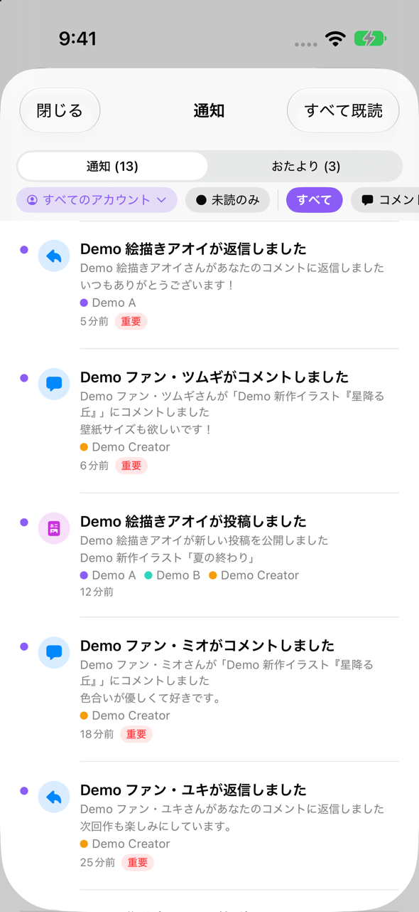
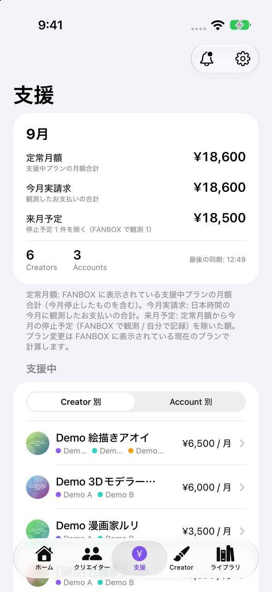

<div align="center">


# FANBOX Personal Client

**Several pixivFANBOX accounts, one local-first iOS app**


<p>
  
  
  
  
</p>

<sub>Screenshots use the built-in demo accounts. All creators and posts in them are fictional.</sub>

</div>

---

FANBOX Personal Client is a personal iOS app for people who use more than one pixivFANBOX / pixiv account.
It reads posts, comments, notifications, newsletters (おたより) and support state for every account, stores them in a
local SwiftData database, and shows one merged view. The screens render from the local database first and refresh
from the network afterwards, so a slow or missing connection does not block reading, searching, drafting or replying.

The app is not distributed through the App Store, and it is not affiliated with or endorsed by pixiv Inc.
The full specification (in Japanese) is in [SPEC.md](SPEC.md).

> **Status: not yet tested against the live service.** The FANBOX integration has not been exercised against
> fanbox.cc. No request was sent to fanbox.cc or pixiv.net during development. Today the UI runs on the built-in
> demo accounts. See [Verification status](#verification-status) and [Known limitations](#known-limitations).

## Contents

- [Features](#features)
- [Verification status](#verification-status)
- [Known limitations](#known-limitations)
- [Requirements](#requirements)
- [Build and test](#build-and-test)
- [Demo mode](#demo-mode)
- [Architecture](#architecture)
- [Repository layout](#repository-layout)
- [Documentation](#documentation)
- [Copyright and license](#copyright-and-license)

## Features

| Area | What it does |
|---|---|
| Accounts | Any number of FANBOX / pixiv accounts. Each account has its own `WKWebsiteDataStore`, its own Keychain credential and its own `URLSession`, so cookies never mix. A web session is stored for an account only after its logged-in pixiv user was checked against the account. A session that turns out to belong to another pixiv user is deleted and the account stops syncing until it is logged in again. |
| Reader | One timeline across all accounts. A post seen by several accounts is shown once. The app picks the account to read with (cached, can view, valid session, higher plan, main account) and you can switch by hand. Posts render natively: text, images, galleries, files, audio, video, links, embeds and article blocks. |
| Notifications | One inbox for all accounts, with duplicates merged. When an event is detected, the app first tries to fetch the post body or comment thread, then posts the iOS notification. A tap opens the post from the local database. Replies can be written from the notification and are queued offline. Besides FANBOX's own notifications, the app derives 支援状態変化 (support changed), 決済要確認 (payment needs checking) and 新規支援 (new supporter) events from what it observes. |
| Low data | Automatic / Normal / Low Data / Extreme / Offline modes. A text-first scheduler sends comment posts and interactive reads before any media and pauses media transfers while they run. Offline stops every request: queued requests fail, downloads and uploads are cancelled, and no web view loads a page. |
| Transport | FANBOX requests go through the account's `URLSession`, or through a hidden web view of the same account (same cookies and web session). `post.info` and `post.getEditable` use the web view first while the app is in the foreground; other calls switch to it only when Cloudflare stops the native request. A device-wide budget spaces `post.info`, pauses every FANBOX call after a 429 and does not repeat a block across accounts. This design follows public reports (docs/API.md §1.7–§1.11); it has not been checked against the live service. |
| Support | Supports grouped by creator and by account, with monthly totals, this month's actual payments, next month's planned total, a locally observed support history and anomaly flags. Payment profiles (nickname, brand, last four digits, memo) can be linked to each support. Payment itself always happens in the account-aware web view. |
| Creator mode | Dashboard, managed posts, local drafts with a block editor, a media upload queue, comments, fans and plans for accounts that own a creator page. With real accounts, native sends are text-first; see [Known limitations](#known-limitations). |
| Library | Local full-text search, favorites, read later, local tags and memos (never sent to FANBOX), offline saving with a size-limited media cache. |
| Research mode | Redacted request / response / navigation logs, an API schema inspector that flags new or missing fields, account, sync, support and scheduler state, and a switch that forces the native or the web view transport. Debug builds add demo tools that simulate new notifications. |

Not included on purpose: bulk downloading, full-history crawling, and card payment handling inside the app
(see [SPEC.md §3.7](SPEC.md) and [docs/SECURITY.md](docs/SECURITY.md)).

## Verification status

**What the tests cover.** Unit tests (`FANBOXClientTests`) run the modules against in-memory stores, the demo data
source, fake data sources and `URLProtocol` stubs. UI tests (`FANBOXClientUITests`) run a smoke test and a tour that
opens every screen with the demo accounts. They check the app's own logic. They cannot show that FANBOX behaves the
way the code assumes, and none of them sends a request to FANBOX.

**What has not been checked.** No request has been sent from this app to fanbox.cc, pixiv.net or pximg.net. Endpoint
paths, parameters and response shapes in [docs/API.md](docs/API.md) come from reading public sources (docs/API.md §0);
each endpoint there has a confidence rating, and §22 lists the open questions. The decoders are lenient, but none has
seen a real payload.

**What to check on a device.** The first real account is the first live test. Research Mode (Settings → Research /
API Inspector) is the tool for it. The areas below are expected to need verification:

| Area | What to check | Where to look |
|---|---|---|
| Login and identity | Login in the account web view, and the page metadata (`<meta name="metadata">` on www.fanbox.cc). The app reads the logged-in user and the CSRF token from it, and every login and session check is verified with it (`currentUser`, docs/API.md §2.14, §4) | Account State, Navigation |
| Endpoint shapes | Every decoder. The API Inspector marks new and missing fields per endpoint and object path; decode failures are recorded as events | API Schema, Sync / Errors |
| Cloudflare | Whether list and count calls pass over `URLSession` with the web view's cookies and user agent; whether `post.info` passes through the hidden web view; whether the edge-block detection matches the real block pages; whether the request budget is conservative enough. The 通信経路 (transport) switch forces "Native のみ" (native only) or "WebView のみ" (web view only) | 通信経路 section, Requests |
| Writes | Comments, replies and comment deletion, likes, `post.create` / `post.update` (multipart form with the CSRF token in `tt`), and the CSRF refresh after a rejected write. Their response bodies are unknown (docs/API.md §23.4) | Requests, Responses |
| Web pages | The URLs marked *unverified* in docs/API.md §20: login, plan pages, supporting plans list, payment settings and history, notifications list, newsletter inbox, new-post editor | Navigation, fallback banner |
| Derived events | 決済要確認 from `hasUnpaidPayments` / `payment.listUnpaid`, 新規支援 from the fan list, 支援状態変化 from the supporting-plan list | Support State, notification inbox |
| Background | When iOS runs `BGAppRefreshTask`, and what the native transport can fetch in the background | Scheduler, Requests |

Research Mode can also record the API calls FANBOX's own pages make inside the account web view (structure only:
method, redacted URL, status, field names). This is how the post editor's media upload endpoint, which the research
could not find (docs/API.md §15.1), can be read from your own session.

## Known limitations

**Creator Mode with real FANBOX accounts.** The FANBOX write API is reconstructed from public sources and has not
been verified against the live service (docs/API.md §14–§15).

- **Native sends cover text and headings only.** Image and file uploads, new link cards, new embeds, the R-18 flag and
  plan-specific gating (FANBOX gates by minimum fee) have no documented request shape. The editor marks these blocks
  "Web" before you publish. Sending saves the text first as a FANBOX draft, then hands off to the account's web editor
  with an ordered checklist and the app's resized / converted images exported for the web file picker. The demo
  account supports every block natively, so you can try the full flow offline.
- **Post Edit round-trip.** Unchanged paragraphs are sent back as they were, including bold, links and empty spacing
  paragraphs. Media, link cards and embeds that are already on the post are kept by their ids. An edited paragraph
  keeps the styles outside the edited text; the app asks before it sends a change that would drop any. Posts the app
  cannot write back faithfully (non-article posts, scheduled posts, unknown block types) are edited in the web editor.
  If FANBOX does not report the tags or the comment permission, the app asks before it overwrites them.
- **No accidental unpublish or overwrite.** Updating a live post keeps it published. Taking it down to a draft needs
  explicit confirmation. Before each update the app reads the post again and stops if it changed elsewhere, for example
  in the web editor, so local content never overwrites that change.

**Other limitations.**

- **Google sign-in does not work.** Google refuses OAuth sign-in inside embedded web views (`WKWebView`). pixiv
  accounts that only use "Sign in with Google" cannot log in through the app. Set a pixiv password first, then log in
  with the pixiv ID / e-mail address and that password. The add-account screen and the login sheet say so.
- **Support and payment changes stay on the web.** Starting, changing or stopping a support and changing the payment
  method happen in the account web view. The app never handles card data (docs/SECURITY.md). After a payment session
  it syncs supports again, because FANBOX can take a while to show the change.
- **`post.info` in the background.** The hidden web view transport runs only while the app is in the foreground.
  Background refresh and silent pushes use `URLSession` only. If FANBOX blocks `post.info` for `URLSession`, as
  reported since 2026-04 (docs/API.md §1.7), a notification's post body cannot be fetched in the background. The iOS
  notification is then posted with the text from the notification listing, and the fetch is retried when the app
  becomes active.
- **Unverified web URLs.** When a requested page answers 404 or 410, the account web view moves to the next page of a
  fallback chain that ends at a page reported to exist (docs/API.md §20). The login page (`https://www.fanbox.cc/login`)
  has no automatic fallback in the current code.
- **No entitlements file.** Critical notifications are delivered as `.active` because the Time Sensitive entitlement
  is missing, and APNs registration for the optional relay fails without `aps-environment`. The relay server is not
  part of v1.0 ([docs/NOTIFICATION_RELAY.md](docs/NOTIFICATION_RELAY.md)).
- **The request budget is inferred.** The spacing, background budget and cooldowns in `RateGate` follow third-party
  reports (docs/API.md §1.8), not measurements.

## Requirements

- macOS with **Xcode 27** (iOS 27 SDK; the deployment target is iOS 26)
- An iPhone or simulator running **iOS 26** or later
- **[XcodeGen](https://github.com/yonaskolb/XcodeGen)** (`brew install xcodegen`). The Xcode project is generated from
  `project.yml` and is not committed.

There are no Swift packages, CocoaPods or other third-party dependencies. See [THIRD_PARTY.md](THIRD_PARTY.md).

## Build and test

```sh
# Generate the project and build the app for the iOS Simulator.
scripts/build.sh

# Also compile the unit / UI test targets.
scripts/build.sh build-for-testing

# Run tests on one simulator (default "iPhone 17 Pro"; override with SIM_DEVICE=...).
scripts/test.sh -only-testing:FANBOXClientTests/SettingsModuleTests

# Remove this checkout's DerivedData folder.
scripts/clean-dd.sh
```

- `scripts/build.sh` runs `xcodegen generate`, builds with `xcodebuild`, and prints only warnings / errors from this
  repository plus the final `** BUILD SUCCEEDED **` / `** BUILD FAILED **` line. `JOBS` sets the number of compile
  jobs (default 2).
- `scripts/test.sh` takes a lock at `/tmp/fanbox-sim-lock`, so parallel checkouts on one machine share one simulator
  in turn. Exit code 75 means the lock timed out; run it again.
- To work in Xcode, run `xcodegen generate` and open `FANBOXClient.xcodeproj`. Code signing uses the team in
  `project.yml`; change `DEVELOPMENT_TEAM` for your own device builds.

## Demo mode

Demo accounts use `DemoRemoteDataSource`: fixture data in an in-memory demo world, a short simulated delay per call,
and images drawn on the device (`DemoMediaRenderer`). They never touch the network. They do follow the network mode,
so Offline mode can be tried with them. All creators and posts in the demo data are fictional.

### Adding demo accounts in the app

Settings → アカウント (Accounts) → デモアカウントを追加 (Add demo account). The same button is on the
アカウントを追加 (Add account) screen. It is available in every build. These accounts are named "Demo", "Demo 2", …
and each reads as one of two fixture viewer profiles. The "Demo Creator" account, which owns the demo creator page
used by Creator Mode, is created only by the `-demoData` launch argument (and by `AppEnvironment.preview`).

### Launch arguments

| Argument | Effect |
|---|---|
| `-demoData` | When there are no accounts at all, adds three demo accounts: "Demo A", "Demo B" and "Demo Creator" (owner of the demo creator page `demo-creator-self`). |
| `-uiTesting` | Uses an in-memory SwiftData store, an in-memory credential store, a throwaway `UserDefaults` suite and in-memory transport preferences, and skips the notification permission request, so the database, credentials and settings start fresh on every launch. |
| `-initialTab <tab>` | Starts on a tab: `home`, `creators`, `support`, `creatorMode` or `library`. |
| `-openRoute <route>` | Pushes a screen at launch: `post:<postID>`, `creator:<creatorID>`, `comments:<postID>`, `newsletter:<id>`, `supportCreator:<creatorID>`, `supportAccount:<accountID>`, `draft:<draftID>`, `plans:<creatorID>`, `search:<query>`, `tag:<name>`, or one of `supportHistory`, `paymentProfiles`, `creatorComments`, `fans`, `offlineLibrary`. Example: `post:demo-post-101`. |
| `-openSheet <sheet>` | Opens `settings` or `notifications` at launch. |

`-initialTab`, `-openRoute` and `-openSheet` are read from the `UserDefaults` argument domain (`AppRouter`), so they
take a value. In Xcode, set arguments under *Scheme > Run > Arguments Passed On Launch*. The UI tests launch with
`-uiTesting -demoData`. Previews and unit tests use `AppEnvironment.preview(seedDemo:)`, which builds the same demo
setup in memory.

### Research Mode demo tools (debug builds)

Demo fixtures are imported silently by the first sync, and later syncs return the same fixtures, so nothing new
arrives on its own. In debug builds, Settings → Research / API Inspector has a デモツール（DEBUG） (demo tools)
section while an enabled demo account exists:

- 新着投稿を発生させる (new post), コメントを発生させる（Demo Creator 宛） (comment on a Demo Creator post),
  おたよりを発生させる (newsletter).

Each action adds one item to the demo world and runs one regular foreground polling tick (for a newsletter, an
explicit notifications sync, because automatic polling reads newsletters at most every 10 minutes). This exercises
the real path without FANBOX: detection → text prefetch → local iOS notification → tap routing. The comment action
needs the "Demo Creator" account. Nothing runs in Offline mode.

### Screenshots

`scripts/shot.sh <out.png> [arguments]` launches the demo app and saves a screenshot. The README screenshots were
taken this way. Before using it:

- Build first (`scripts/build.sh`). The script does not build. It installs the most recently modified
  `FANBOXClient-*/Build/Products/Debug-iphonesimulator/FANBOXClient.app` in `~/Library/Developer/Xcode/DerivedData`,
  which can be another checkout's build if you have several.
- It uses its own simulator, not the one `scripts/test.sh` uses. The default `SHOT_DEVICE` is a simulator UDID from
  the maintainer's machine; set `SHOT_DEVICE=<udid>` (see `xcrun simctl list devices`).
- It always launches with `-uiTesting -demoData` followed by your arguments, waits `SHOT_WAIT` seconds (default 7),
  and overrides the status bar (9:41, full battery). `SHOT_REINSTALL=0` skips reinstalling the app.

## Architecture

```text
SwiftUI views (Features/*)          render from SwiftData with @Query; no endpoints, no JSON
        |
        v
Services (Core/*, AppEnvironment)   SyncEngine, SyncCoordinator, ReplyQueue, NotificationService, MediaService,
                                    OfflineLibraryService, AccountService, WebBridge, UploadQueue, DraftService ...
        |
        v
LocalStore (SwiftData, the only writer)  <---  RemoteDataSource, chosen per account:
                                                 FanboxRemoteDataSource -> FanboxAPIClient
                                                 DemoRemoteDataSource (fixtures, no network)
                                                        |
                                                        v
                  RoutingHTTPClient   (asks RateGate first: device-wide budget, 429 cooldown, edge-block breakers)
                    |                          |
          AccountHTTPClient              WebFetchHostPool
          (per-account URLSession)       (hidden per-account WKWebView, foreground only)
                    |                          |
                    +---- NetworkScheduler ----+   text first; Offline stops everything
                                 |
                   api.fanbox.cc / www.fanbox.cc / media hosts
```

The app starts from the local database. Network work begins after the first frame, writes through `LocalStore`, and
the views update through `@Query`. Differential sync reads newest-first and stops at the first known post. Network
errors never delete cached data.

Notifications are treated as a trigger to fetch text, not as something to look at later. The app fetches the body
before it posts the iOS notification, so opening it normally does not start an HTTP request:

```text
FANBOX event
  | foreground polling / launch refresh / BGAppRefreshTask / optional silent push
  v
event detected --> text prefetch (comment thread, post body, おたより)   priority: notificationPrefetch
  |
  v
local database --> iOS notification (inline 返信 (Reply) action)
  |
  v
tap --> post / thread rendered from the local database
reply --> queued locally --> sent as interactiveWrite, ahead of any media transfer
```

If the prefetch fails (offline, blocked), the notification is still posted with the text of the notification
listing, and the prefetch is retried when the app becomes active.

Details: [docs/ARCHITECTURE.md](docs/ARCHITECTURE.md).

## Repository layout

```text
FANBOXClient/
  App/          entry point, AppEnvironment (dependency container), router, settings
  Features/     SwiftUI screens: Home, Creator, Support, CreatorMode, Notifications, Library, Settings
  Core/         Models, Database, Network, Authentication, Sync, Notifications, Media, Payments, Security, Web
  Fanbox/       API client, adapter (DTO -> Remote* values), demo data source, research recorder, schema inspector
  UI/           shared components (account badges, sync banner, remote images, image viewer)
  Resources/    Info.plist, asset catalog
FANBOXClientTests/     unit tests (hosted in the app)
FANBOXClientUITests/   UI smoke test and screen tour
docs/                  architecture, security, network modes, notification relay, API notes
scripts/               build / test / screenshot / cleanup helpers
project.yml            XcodeGen project definition
```

## Documentation

- [SPEC.md](SPEC.md): product specification v1.0 (Japanese)
- [docs/ARCHITECTURE.md](docs/ARCHITECTURE.md): layers, data flow, sync, transport, scheduler, notification pipeline, file map
- [docs/SECURITY.md](docs/SECURITY.md): sensitive data storage, account identity, teardown, redaction, Research Mode
- [docs/NETWORK_MODES.md](docs/NETWORK_MODES.md): communication modes, request priorities and the request budget
- [docs/NOTIFICATION_RELAY.md](docs/NOTIFICATION_RELAY.md): design of the optional APNs relay
- [docs/API.md](docs/API.md): notes on the unofficial FANBOX API (facts only, gathered for interoperability)
- [THIRD_PARTY.md](THIRD_PARTY.md): third-party license inventory and review procedure
- [CONTRIBUTING.md](CONTRIBUTING.md): contribution policy

## Copyright and license

```text
Copyright © 2026 Masahiro Sato. All rights reserved.

No license is granted for this source code.
The source code is publicly available for inspection only.
Permission to use, copy, modify, distribute, sublicense, or create
derivative works is not granted unless separately authorized by
the copyright holder.
```

- Public source is not open source. If this repository is public, it is public so the code can be read. It does not
  grant rights to use it.
- There is **no LICENSE file on purpose**. The project may move to a license such as MIT, Apache-2.0 or MPL later.
  Until then, all rights are reserved.
- **External pull requests are not accepted** until the copyright and relicensing policy is settled. See
  [CONTRIBUTING.md](CONTRIBUTING.md).
- No third-party code is bundled. PixiView-KMP and fankt were read only to understand FANBOX behavior, endpoints and
  data shapes. No code was copied from them. See [THIRD_PARTY.md](THIRD_PARTY.md).
- pixiv and pixivFANBOX are services of pixiv Inc. This project is unofficial and has no relationship with pixiv Inc.
